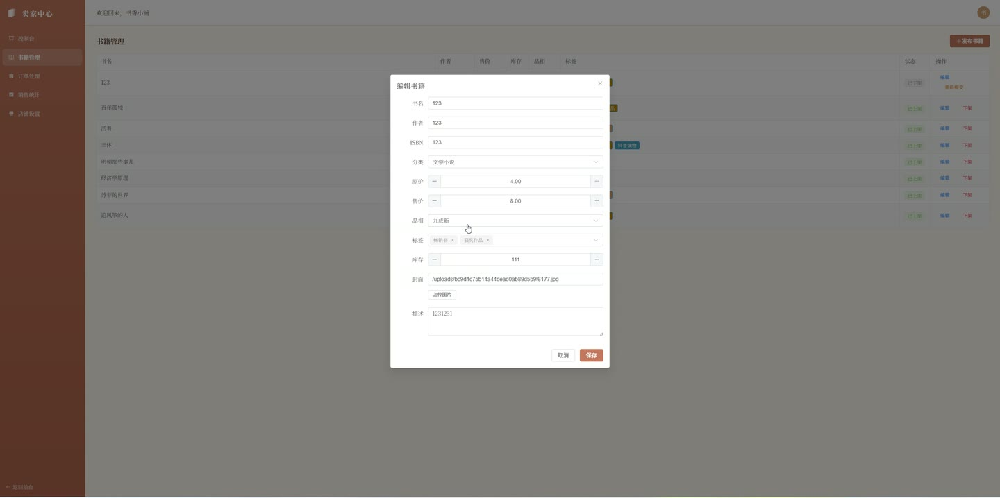
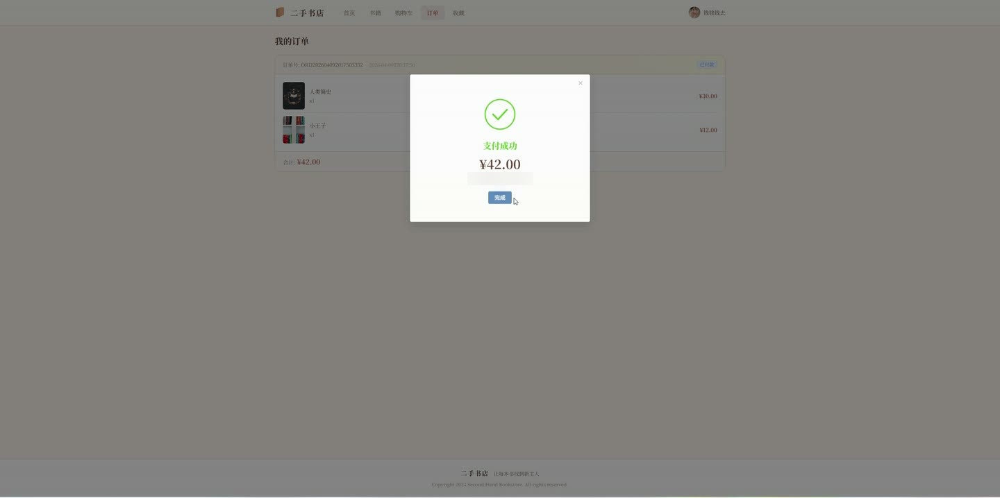
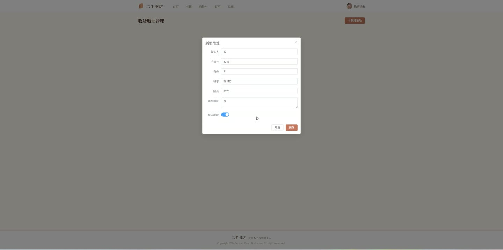
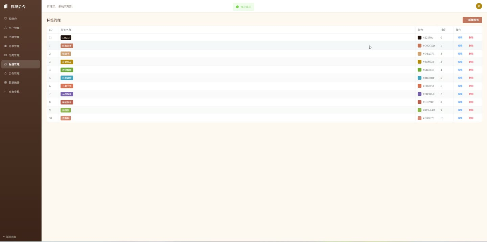

# (附文档)Springboot3+Vue3+MySQL 二手书店网站

**技术栈**：Springboot3、Vue3、MySQL

### 系统简介

本系统是一个基于 Spring Boot 3 + Vue 3 + MySQL 的二手书交易平台，采用前后端分离架构，支持普通用户浏览购买、卖家上架管理、管理员后台审核与数据统计等完整业务流程。
 
### 核心功能
 
### 普通用户端

 
- 浏览书籍列表（支持按分类筛选、关键词搜索书名/作者/ISBN） 
- 查看书籍详情（含封面、作者、原价/售价、品相、库存、卖家信息） 
- 将书籍加入购物车（已存在时自动增加数量） 
- 修改购物车中图书数量、删除购物车项 
- 从购物车提交订单（填写收货地址、电话、收货人姓名、备注） 
- 查看个人订单列表（按下单时间倒序，显示订单号、总金额、状态） 
- 对待付款订单进行支付操作（模拟支付，状态变更为已付款） 
- 对已发货订单确认收货（状态变更为已完成） 
- 取消待付款订单（状态变更为已取消） 
- 收藏/取消收藏书籍，查看收藏列表（显示书名、封面、价格、作者） 
- 管理收货地址（新增、编辑、删除，支持设置默认地址） 
- 编辑个人资料（昵称、手机、邮箱、头像） 
- 修改登录密码（需验证原密码） 
- 提交成为卖家申请（填写申请理由，等待管理员审核） 
- 查看卖家申请审核状态
 
### 卖家端

 
- 查看店铺统计数据（总书籍数、在售数、订单数、总销售额） 
- 管理自家书籍（新增、编辑、删除，新增时需填写书名、作者、分类、原价/售价、品相、库存、封面、描述等） 
- 查看自家商品订单列表（含买家昵称、订单内商品明细） 
- 对已付款订单进行发货操作（填写物流单号，状态变更为已发货） 
- 查看热销书籍排行（按销售额降序，显示书名、销售额、销量） 
- 编辑店铺信息（店铺名称、店铺描述）
 
### 管理员端

 
- 查看平台总览仪表盘（用户数、书籍数、订单数、卖家数、总成交额、订单状态分布、分类分布、角色分布、近期交易趋势） 
- 管理用户列表（按用户名/昵称搜索，支持启用/禁用用户账号） 
- 管理书籍列表（按状态筛选、关键词搜索，审核上架/下架书籍） 
- 查看所有订单（含买家昵称、订单内商品明细） 
- 管理图书分类（新增、编辑、删除，删除前检查分类下是否有书籍） 
- 管理图书标签（新增、编辑、删除，支持排序和颜色） 
- 管理平台公告（新增、编辑、删除，可控制发布状态） 
- 审核卖家开店申请（通过/驳回，通过后自动将用户角色变更为卖家并启用账号）
 
### 技术栈

 后端框架Spring Boot 3.x ORMMyBatis-Plus 权限认证JWT（jjwt） 密码加密BCryptPasswordEncoder 前端框架Vue 3（Composition API） 状态管理Pinia 前端路由Vue Router 4 UI 组件库Element Plus 构建工具Vite 数据库MySQL 8.x 文件上传MultipartFile 本地存储
 
### 交付内容

 
- 后端完整源码 
- 前端完整源码 
- 数据库初始化脚本 
- 万字文档

## 界面展示

---

## 获取完整源码 + 万字文档

本仓库为项目介绍页。**完整前后端源码、数据库初始化脚本、万字项目文档**，请加微信 `kangkangcode`，或访问 [codekk.top](http://codekk.top) 获取。

可作课程设计 / 毕业设计参考，支持远程部署调试。